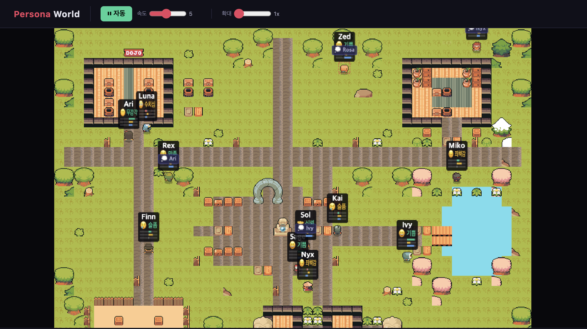

# Persona World

A pixel art world simulation where AI characters with unique personalities interact, form relationships, and experience real-time emotions.

Powered by the [molroo](https://molroo.io) emotion engine.



## What is this?

Each character has a distinct [HEXACO](https://en.wikipedia.org/wiki/HEXACO_model_of_personality_structure) personality profile that shapes how they act and react. When characters interact, the molroo emotion engine computes realistic emotional responses using a VAD (Valence-Arousal-Dominance) model.

- Characters autonomously choose who to interact with and what actions to take
- Emotional state changes in real-time based on interactions
- Relationships evolve over time -- characters remember how others treated them
- 16 different interaction types from affection to betrayal

## Quick Start

```bash
git clone https://github.com/molroo-io/persona-world.git
cd persona-world
npm install
cp .env.example .env   # Add your API key
npm run dev            # Open http://localhost:5173
```

Only `VITE_API_KEY` is required. On first run, the app automatically creates a world and seeds 12 characters via the [molroo SDK](https://www.npmjs.com/package/@molroo-io/sdk).

Get your API key at [molroo.io](https://molroo.io).

## Environment Variables

| Variable | Required | Description |
|----------|----------|-------------|
| `VITE_API_KEY` | Yes | API key from [molroo.io](https://molroo.io) |
| `VITE_WORLD_ID` | No | Use an existing world (auto-created if omitted) |
| `VITE_API_URL` | No | API base URL (default: `https://api.molroo.io`) |

## Characters

12 pre-configured characters defined in [`src/data/personas.ts`](src/data/personas.ts). Each has a unique [HEXACO](https://en.wikipedia.org/wiki/HEXACO_model_of_personality_structure) personality profile that you can customize:

| Name | Personality | Traits |
|------|------------|--------|
| Luna | Dreamy painter | Creative, Sensitive |
| Rex | Gym coach | Extraverted, Competitive |
| Sage | Stoic philosopher | Calm, Sincere |
| Miko | Cafe owner | Cooperative, Disciplined |
| Kai | Restless traveler | Creative, Extraverted |
| Nyx | Brooding poet | Introverted, Sensitive |
| Ari | Village nurse | Cooperative, Sincere |
| Zed | Cunning trickster | Extraverted, Pragmatic |
| Sol | Retired captain | Disciplined, Sincere |
| Ivy | Ambitious journalist | Creative, Extraverted |
| Finn | Shy librarian | Creative, Sensitive |
| Rosa | Street dancer | Extraverted, Creative |

## Tech Stack

- **Frontend**: React 19 + TypeScript + Vite
- **Rendering**: Canvas 2D with pixel art sprites
- **Emotion Engine**: [@molroo-io/sdk](https://www.npmjs.com/package/@molroo-io/sdk)
- **i18n**: Auto-detects browser language (English / Korean). Override with `?lang=en` or `?lang=ko`

## How It Works

```
User/Auto Action -> molroo API -> Emotion Engine -> VAD Response -> UI Update
                                       |
                              HEXACO Personality
                              Appraisal Model
                              Emotional Memory
```

1. An action (e.g. "praise", "tease", "betray") is sent to a target character
2. The molroo emotion engine appraises the action based on the character's personality
3. A new emotional state (VAD + discrete emotion label) is computed
4. The UI reflects the change -- facial expression, color, emotion label, and relationship score

## Building

```bash
npm run build    # Production build -> dist/
```

## License

MIT
